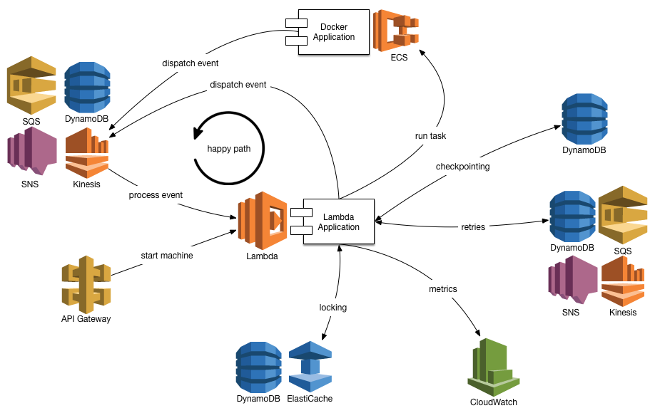

<!--
Copyright 2016-2020 Workiva Inc.

Licensed under the Apache License, Version 2.0 (the "License");
you may not use this file except in compliance with the License.
You may obtain a copy of the License at

    http://www.apache.org/licenses/LICENSE-2.0

Unless required by applicable law or agreed to in writing, software
distributed under the License is distributed on an "AS IS" BASIS,
WITHOUT WARRANTIES OR CONDITIONS OF ANY KIND, either express or implied.
See the License for the specific language governing permissions and
limitations under the License.
-->

[<< TODO](TODO.md) | [Overview >>](OVERVIEW.md)

The FSM implementation is inspired by the paper

[1] J. van Gurp, J. Bosch, "On the Implementation of Finite State Machines", in Proceedings of the 3rd Annual IASTED
    International Conference Software Engineering and Applications,IASTED/Acta Press, Anaheim, CA, pp. 172-178, 1999.
    (www.jillesvangurp.com/static/fsm-sea99.pdf)

# Architecture

The system is designed to run on AWS. 

## Code execution

Code execution is accomplished via both:

1. [AWS Lambda](https://aws.amazon.com/lambda/) and 
1. (EXPERIMENTAL) [AWS ECS](https://aws.amazon.com/ecs/). 

 [AWS ECS](https://aws.amazon.com/ecs/) is used to run any containerized applications you may want to add to a 
workflow, but it is not the only option.  It is very straightforward 
to implement an `Action` class that starts a container in any system that is able 
to execute containerized applications, be it open-sourced or in-house.

## Event dispatch

Event dispatch can be handled by several different AWS services. Since [AWS Lambda](https://aws.amazon.com/lambda/) 
functions can be driven from several event sources, it is possible to select any of the following for
event dispatch:
 
1. [AWS SQS](https://aws.amazon.com/sqs/) or
1. [AWS Kinesis](https://aws.amazon.com/kinesis/) or
1. [AWS SNS](https://aws.amazon.com/sns/) or
1. [AWS DynamoDB](https://aws.amazon.com/dynamodb/)

The system also supports the notion of primary and secondary/failover event sources,
so it is possible to specify two of the above sources. In the event of service issues on 
the primary source, the system will automatically dispatch events to the secondary
source.

## Retries

Retries of failed state transitions can be handled by several different AWS services:

1. [AWS SQS](https://aws.amazon.com/sqs/) or
1. [AWS Kinesis](https://aws.amazon.com/kinesis/) or
1. [AWS SNS](https://aws.amazon.com/sns/) or
1. [AWS DynamoDB](https://aws.amazon.com/dynamodb/)

Either [AWS DynamoDB](https://aws.amazon.com/dynamodb/) or [AWS SQS](https://aws.amazon.com/sqs/) are 
the preferred mechanism for retries, since they are the only two sources that support the notion of 
backoff (running something after a specified delay).

## Checkpointing

Checkpointing can be handled by a only a single system at the moment:

1. [AWS DynamoDB](https://aws.amazon.com/dynamodb/)

[AWS DynamoDB](https://aws.amazon.com/dynamodb/) is able to store the offset of the most recently
dispatched [AWS Kinesis](https://aws.amazon.com/kinesis/) message.

## Locks and Idempotency

A cache is used to prevent re-execution of state transitions and to prevent
concurrent execution in error scenarios. Two AWS services are suitable for 
this task:

1. [Memcache/Redis](https://aws.amazon.com/elasticache/)
1. [AWS DynamoDB](https://aws.amazon.com/dynamodb/)

## Monitoring

When problems occur during code execution, these problems are recorded as custom
metrics in:

1. [AWS CloudWatch](https://aws.amazon.com/cloudwatch/)

[<< TODO](TODO.md) | [Overview >>](OVERVIEW.md)
