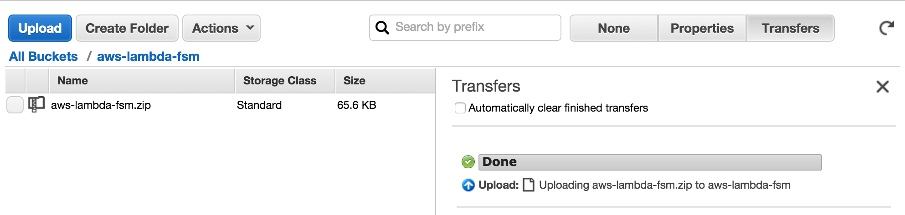
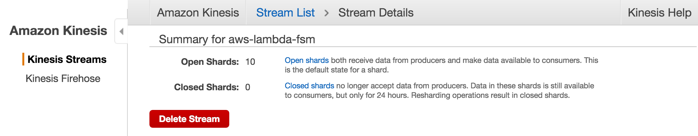
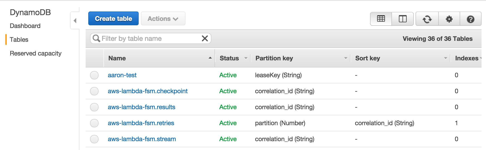
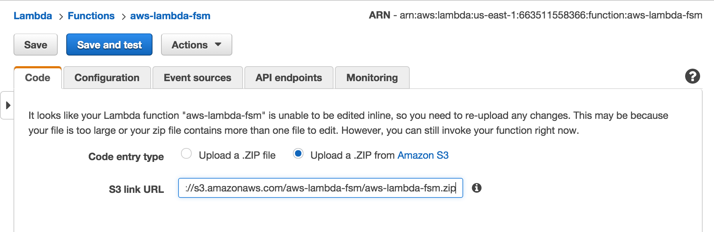
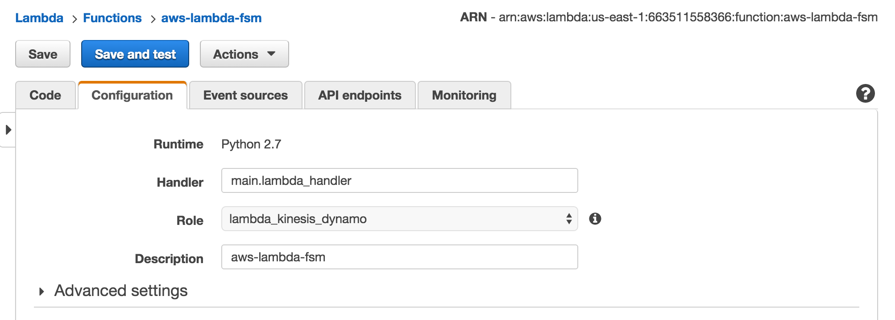
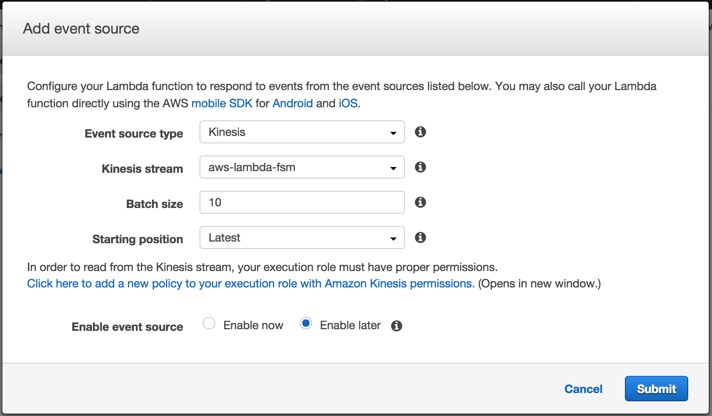
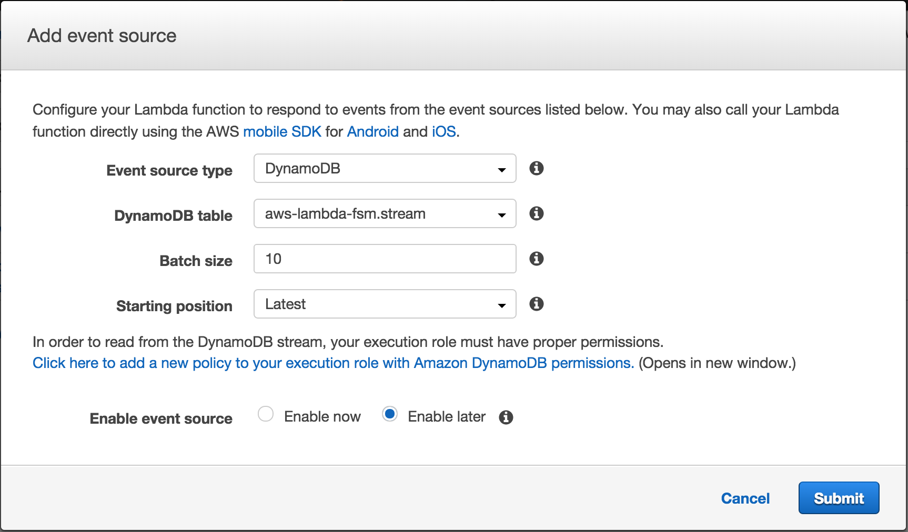
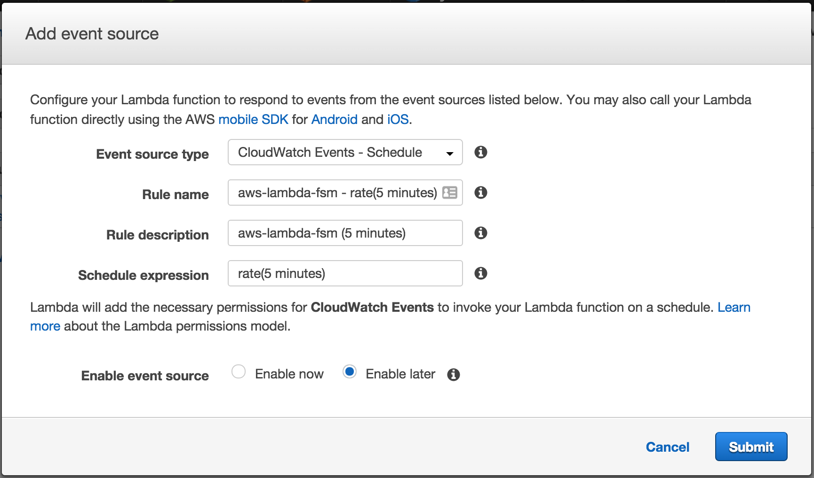
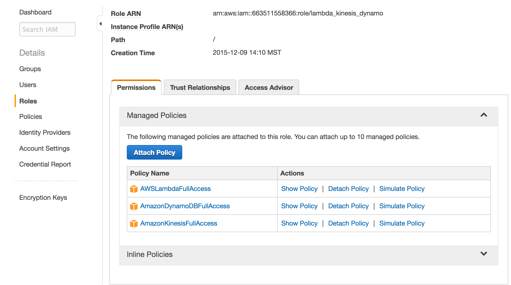

<!--
Copyright 2016-2020 Workiva Inc.

Licensed under the Apache License, Version 2.0 (the "License");
you may not use this file except in compliance with the License.
You may obtain a copy of the License at

    http://www.apache.org/licenses/LICENSE-2.0

Unless required by applicable law or agreed to in writing, software
distributed under the License is distributed on an "AS IS" BASIS,
WITHOUT WARRANTIES OR CONDITIONS OF ANY KIND, either express or implied.
See the License for the specific language governing permissions and
limitations under the License.
-->

[<< Running Locally](LOCAL.md) | [Running on AWS Step Functions >>](STEP.md)

# Running on AWS

# Build and Deploy Lambda Function Code

## Build .ZIP

Build a .zip file containing you application code. For example, to build the 
aws-lambda-fsm example applications you can do the following:

```bash
$ workon aws-lambda-fsm-workflows
(aws-lambda-fsm)[aws-lambda-fsm-workflows (master)]$ make build
  ...
  adding: yaml/serializer.py (deflated 78%)
  adding: yaml/tokens.py (deflated 78%)
```
      
If you have written a custom application that brings in aws-lambda-fsm as a module,
you will have to ensure that pyyaml and (optionally) python-memcached are included
in your .zip file.
    
## Upload to S3



# Configure AWS Services

## Setup ~/.aws/credentials

```bash
$ cat ~/.aws/credentials
# Will expire on 2016-03-02T17:22:44Z
aws_access_key_id = ...
aws_secret_access_key = ...
aws_security_token = ...
aws_session_token = ...
```
    
## Setup ~/.aws/config

```bash
$ cat ~/.aws/config
[default]
region=us-east-1
output=json
```

## Create Kinesis Stream

```bash
$ workon aws-lambda-fsm
$ python tools/create_kinesis_stream.py --kinesis_num_shards=##
```
    


## Create DynamoDB Tables

```bash
$ workon aws-lambda-fsm
$ python tools/create_dynamodb_table.py --dynamodb_read_capacity_units=## --dynamodb_write_capacity_units=##
```



## Create Memcache/Redis

TODO:
    
## Create and Configure the Lambda Function

### Code


     
### Handler

Configure the Lambda function handler as `main.lambda_handler`
    


### Event Sources

Configure the Lambda function with three event sources

1. Kinesis Stream



2. DynamoDB Update



3. CloudWatch Timer



### IAM

Configure the Lambda function with a role like the following:


    
# Start a State Machine

You can use the `start_state_machine.py` script to start machines on AWS as well:

```bash
$ workon aws-lambda-fsm-workflows
$ python tools/start_state_machine.py --machine_name=tracer
```

[<< Running Locally](LOCAL.md) | [Running on AWS Step Functions >>](STEP.md)
