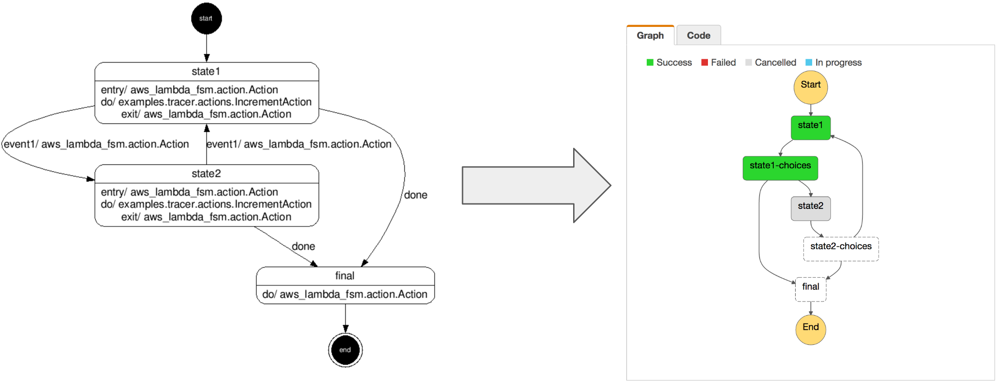

<!--
Copyright 2016-2020 Workiva Inc.

Licensed under the Apache License, Version 2.0 (the "License");
you may not use this file except in compliance with the License.
You may obtain a copy of the License at

    http://www.apache.org/licenses/LICENSE-2.0

Unless required by applicable law or agreed to in writing, software
distributed under the License is distributed on an "AS IS" BASIS,
WITHOUT WARRANTIES OR CONDITIONS OF ANY KIND, either express or implied.
See the License for the specific language governing permissions and
limitations under the License.
-->

[Running on AWS >>](AWS.md) | [Setup AWS Services >>](SETUP.md)

# Running on AWS Step Functions

[AWS Step Functions](https://aws.amazon.com/step-functions/) has tight integration with 
[AWS Lambda](https://aws.amazon.com/lambda/) and can easily be used to execute an existing
deployed FSM.

Simply use the provided script in `tools/yaml_to_json.py` to generate a 
[State Language](https://states-language.net/spec.html) JSON document pointing at the 
an existing deployed FSM [AWS Lambda](https://aws.amazon.com/lambda/) function. 

```bash
% python tools/yaml_to_json.py --machine_name=tracer --lambda_arn=arn:aws:lambda:us-east-1:999999999999:function:fsm
{
  "Comment": "tracer",
  "States": {
    "state1": {
      "Resource": "arn:aws:lambda:us-east-1:999999999999:function:fsm",
      "Type": "Task",
      "Next": "state1-choices"
    },
    ...
  }
  "StartAt": "state1"
}
```
    
The deployed `fsm.yaml` and the JSON document must match, otherwise the machines can get 
out of sync. So changes to the `fsm.yaml` require corresponding changes the JSON document.




[Running on AWS >>](AWS.md) | [Setup AWS Services >>](SETUP.md)
